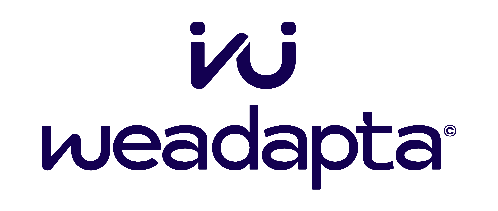

# WeAdapta: Inclusión a través del juego

  

**Descripción**  
WeAdapta es una organización sin fines de lucro que adapta juguetes para niños con discapacidades motoras o sensoriales, promoviendo la inclusión y el acceso igualitario al juego. Los juguetes adaptados son distribuidos gratuitamente a familias y centros educativos o terapéuticos.  

**Tecnología y Método**  
Con un equipo interdisciplinario, WeAdapta utiliza electrónica, robótica y comunicación accesible para modificar juguetes y garantizar su funcionalidad para niños con diferentes capacidades.

## ¿Cómo puedes ayudar?

1. **Donar juguetes:** Nuevos o usados que puedan ser adaptados.
2. **Voluntariado:** Participa aportando habilidades en diseño, tecnología o logística.
3. **Difusión:** Comparte su labor para llegar a más personas e instituciones.

## 🌟 ¡Conecta con nosotros! 🌟

Síguenos en nuestras redes sociales para estar al tanto de todas las novedades:

